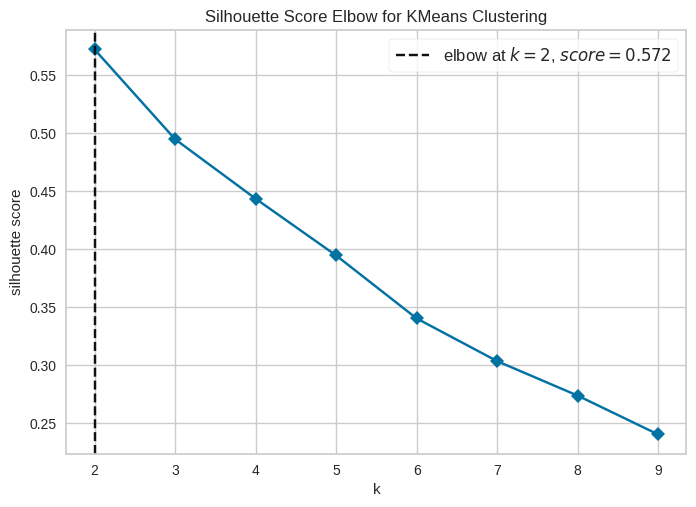
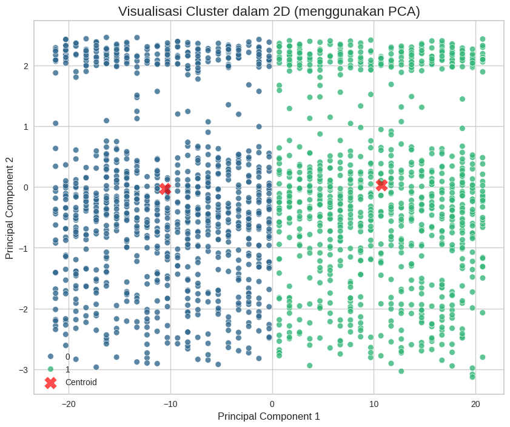
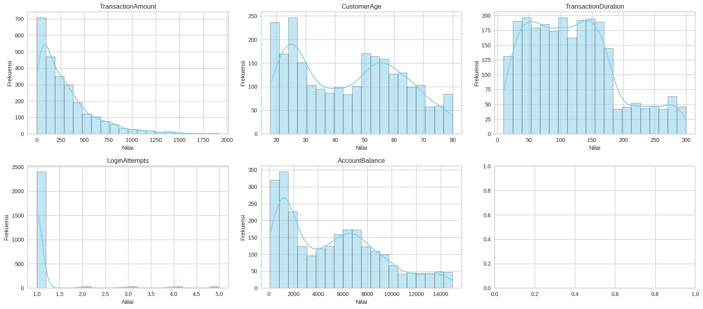
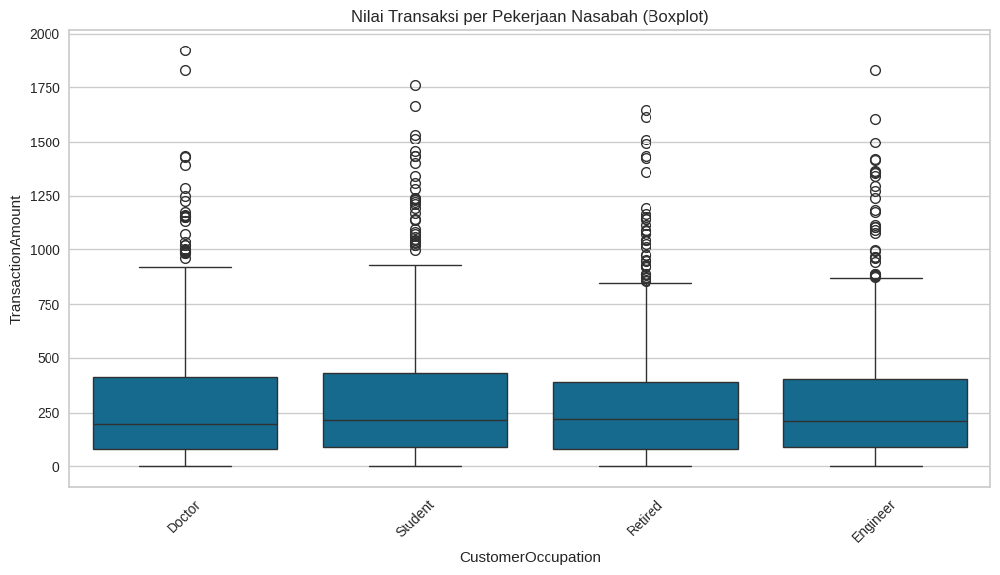

# Fraud Detection Clustering using K-Means


An Unsupervised Machine Learning project for customer transaction clustering using K-Means and Principal Component Analysis (PCA) to identify transaction patterns related to fraud detection.

---

## Overview

This project performs customer segmentation based on transaction behavior using K-Means Clustering.

The workflow covers the complete clustering pipeline, including:

- Data preprocessing
- Exploratory Data Analysis (EDA)
- Feature scaling
- Correlation analysis
- K-Means clustering
- Cluster evaluation
- PCA visualization

---

## Dataset

The dataset contains synthetic customer transaction information.

Features:

- Transaction Amount
- Customer Age
- Transaction Duration
- Login Attempts
- Account Balance
- Customer Occupation

---

## Features

- Data preprocessing
- Correlation Matrix
- Feature Distribution Analysis
- Transaction Boxplot Analysis
- K-Means Clustering
- Silhouette Score Evaluation
- PCA Dimensionality Reduction
- Cluster Visualization
- Saved K-Means Model
- Saved PCA Model

---

## Project Structure

```text
clustering-project/
├── assets/
│   ├── correlation-matrix.png
│   ├── feature-distributions.png
│   ├── transaction-boxplot.png
│   ├── silhouette-score.png
│   └── cluster-visualization.png
├── dataset/
│   ├── data_clustering.csv
│   └── data_clustering_inverse.csv
├── models/
│   ├── model_clustering.h5
│   └── PCA_model_clustering.h5
├── fraud_detection_clustering.ipynb
├── requirements.txt
└── README.md
```

---

## Clustering Performance

| Metric | Value |
|--------|-------:|
| Optimal Clusters | **2** |
| Silhouette Score | **0.572** |

### Silhouette Score



---

## Cluster Visualization

### PCA Cluster Visualization



---

## Exploratory Data Analysis

### Correlation Matrix


### Feature Distributions



### Transaction Distribution by Customer Occupation



---

## Technologies

- Python
- Scikit-learn
- Pandas
- NumPy
- Matplotlib
- Seaborn
- Joblib

---

## Future Improvements

- Experiment with DBSCAN clustering
- Compare with Hierarchical Clustering
- Optimize feature engineering
- Deploy clustering pipeline using Streamlit
- Apply clustering on real-world financial datasets

---

## Author

**Miqdad Badjuber**

GitHub: https://github.com/miqdadbadjuber
